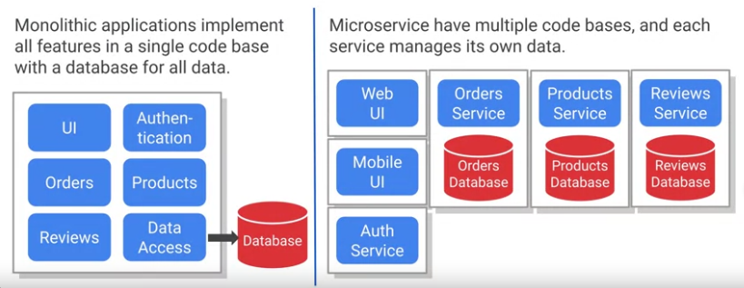
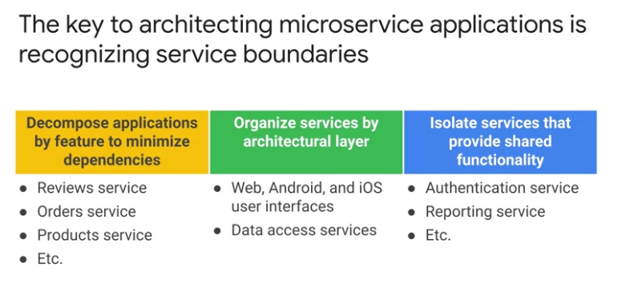

# Microservices

Microservices divede a large program into multiple smalle, independent services.

GCP provides several compute services that facilitate deploying microservices. These include App Engine, Cloud Run, GKE, and Cloud Functions.

| Services      | Description |
| :---          |    :----:   | 
|App Engine     | Description | 
|Cloud Run      | Description | 
|GKE            | Description | 
|Cloud Functions| Description |

Decomposing applications into microservices is one of the biggest technical challenges of application design. 

## Best practices

The 12-factors app is a set of best practices for building web or software as a services applications.

## REST -> Representational State Transfer

## HTTP

## APIs

